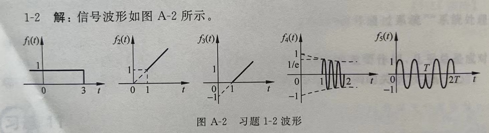

1. **习题 1-2**

    画出下列信号的波形

    (1)$f_1(t)=\varepsilon(-2+3)$;
    (2)$f_2(t)=t\varepsilon(t-1)$;

    (3)$f_3(t)=(t-1)\varepsilon(t-1)$;
    (4)$f_4(t)=[\varepsilon(t-1)-\varepsilon(t-2)]e^{-t}\cos[10(\pi t)]$;

    (5)$f_5(t)=[\varepsilon(t)-2\varepsilon(t-T)+\varepsilon(t-2T)]sin(\frac{4\pi}{T}t)$。
    
    

2. **例题1-8**

    如图1-27（a）所示的门信号$f(t)$,请作出$y(t)=f(-2t+3)$的波形

    

3. **例题2-3**

    判断下列系统是否为线性系统

    (1)$y(t)=t \centerdot f^2(t)$;
    (2)$y(t)=t \centerdot f(t)$;
    (3)$y(t)=x(0\_) +f^2(t)$

    (4)$y(t)=x^2(0\_)+\displaystyle\int^t_0f(\tau)d\tau$;
    (5)$y(t)=5x(0\_)f(t)$(6)$y(t)=3f(t)+6$

    【解】 设$f_1\rightarrow y_1$,$f2\rightarrow y_2$有

    （1）应为$af_1+bf_2\rightarrow t(af_1+bf_2)^2=t(af_1)^2+t(bf_2)^2       +t2adf_1f_2\neq ay_1+ay_2$，所以该系统不满足线性条件，是非线性系统。

    （2）因为$af_1+bf_2\rightarrow t(af_1+bf_2)=atf_1+btf_2=ay_1+by_2$，所以该系统满足新型条件，是线性系统。

    （3）该系统满足分解特性和零输入线性,但不满足零状态线性,是非线性系统。

    （4）该系统满足分解特性和零状态线性,但不满足零输入线性,是非线性系统。

    （5）该系统不满足分解特性，是非线性系统。

    （6） 该系统满足分解特性、零输入线性和零状态线性,在拉斯定义下是线性系统。

4. **例题2-4**

    判断系统$y(t)=tf(t)$是否为事实不变系统。

    【解】响应时移$t_0$后的表达式为

    $$y(t-t_0)=(t-t_0)f(t-t_0)$$

    而激励时移$t_0$后所对应的响应为

    $$T[f(t-t_0)]=tf(t-t_0)$$

    显然，$T[f(t-t_0)]\neq y(t-t_0)$,因此该系统时时变系统。

5. **例题3-5**

    某二阶连续系统的微分方程为

    $$\frac{d^2}{dt^2}y(t)+4\frac{d}{dt}y(t)+3y(t)=\frac{d}{dt}f(t)+2f(t)$$

    求该系统的冲击响应$h(t)$。

    令$f(t)=\delta(t)$并考虑零状态条件，则$y(t)=h(t)$。这样，有
    $$h''(t)+4h'(t)+3h(t)=\delta'(t)+2\delta(t)$$
    特征方程为
    $$\lambda ^2+4\lambda+3=0$$
    特征根为 
    $$\lambda_1=-1,\lambda_2=-3$$
    因为$n>m$。所以，冲击响应为
    $$h(t)=(c_1e^{-t}+c_2e^{-3t})\varepsilon(t)$$
    对上式求导得
    $$
    h'(t)=(c_1+c_2)\delta(t)-(c_1e^{-t}+3c_2e^{-3t})\delta(t)
    $$
    $$
    h''(t) =(c_1+c_2)\delta'(t)-(c_1+3c_2)\delta(t)+(c_1e^{-t}+9c_2e^{-3t})\delta(t)
    $$

    整理得
    $$
    (c_1+c_2)\delta'(t)+(3c_1+c_2)\delta(t)=\delta'(t)+2\delta(t)
    $$
    比较等式两端系数可得
    $$
    \left \{ 
    \begin{array}{c}
    c_1+c_2=1 \\ 
    3c_1+c_2=2 \\ 
    \end{array}
    \right.
    $$
    解得
    $$
    c_1=\frac{1}{2},c_2=\frac{1}{2}
    $$
    则冲激响应为
    $$
    h(t)=\frac{1}{2}(e^{-t}+e^{-3t})\varepsilon(t)
    $$

6. **例题3-6**

    某线性时不变系统的输入输出方程为
    $$
    y''(t)+5y'(t)+6y(t)=3f'(t)+f(t)
    $$
    求系统的阶跃响应和冲激响应。

    【解】令$f(t)=\varepsilon(t)$并考虑零状态条件，则方程可改写为
    $$
    g''(t)+5g'(t)+6g(t)=3\varepsilon'(t)+\varepsilon(t)
    $$
    由特征方程
    $$
    \lambda^2+5\lambda+6=0
    $$
    得特征根
    $$
    \lambda_1=-2,\lambda_2=-3
    $$
    阶跃响应中的齐次解部分为
    $$
    g_e(t)=(c_1e^{-2t}+c_2e^{-3t})\varepsilon(t)
    $$
    阶跃响应中的特解
    $$
    g_p(t)=\frac{b_0}{a_0}\varepsilon(t)=\frac{1}{6}\varepsilon(t)
    $$
    又因为$n>m$,所以，阶跃响应为
    $$
    g(t)=(c_1e^{-2t}+c_2e^{-3t})\varepsilon(t)+\frac{1}{6}\varepsilon(t)
    $$
    其一阶导函数为
    $$
    g'(t)=(c_1+c_2+\frac{1}{6})\delta(t)-2c_1e^{-2t}-3c_2e^{-3t}
    $$
    二阶导函数为
    $$
    g''(t)=(c_1+c_2+\frac{1}{6})\delta'(t)-(2c_1+3c_2)\delta(t)+4c_1e^{-2t}\varepsilon(t)+9c_2e^{-3t}\varepsilon(t)
    $$
    整理得
    $$
    (c_1+c_2+\frac{1}{6})\delta'(t)+(3c_1+2c_2+\frac{5}{6})\delta(t)=3\delta(t)
    $$
    比较上式两端系数,得
    $$
    \left \{ 
    \begin{array}{c}
    c_1+c_2+\frac{1}{6}=0 \\ 
    3c_1+2c_2+\frac{5}{6}=3 \\ 
    \end{array}
    \right.
    $$
    解得
    $$
    c_1=\frac{5}{2},c_2=-\frac{8}{3}
    $$
    阶跃响应为
    $$
    g(t)=(\frac{5}{2}e^{-2t}-\frac{8}{3}e^{-3t})\varepsilon(t)+\frac{1}{6}\varepsilon(t)
    $$
    对$g(t)$求导即得$h(t)$:
    $$
    h(t)=(8e^{-3t}-5e^{-2t})\varepsilon(t)
    $$

7. **因果性判断**

    若一个连续系统的冲激响应为$h(t)$满足
    $$h(t)=0(t<0)$$
    则该系统就是一个因果系统。或者说,冲激响应为因果信号的系统就是因果系统

8. **例题4-1**

    将如图 4-4(b)所示的方波 f(t)展开为傅里叶级数。

    【解】因为$f(t)$为奇对称十奇谐对称,所以$a_0=0,a_n=0$,无偶次谐波。
    $$
    b_n=\frac{4}{T}\int_{0}^{\frac{T}{2}}f(t)\sin\omega_0tdt=\frac{4}{T}\int_{0}^{\frac{T}{2}}\sin\omega_0rdt=-\frac{4}{T}\frac{1}{n\omega_0}\cos n\omega_0t \left.\right|_0^{\frac{T}{2}}
    $$
    $$
    =-\frac{4}{T}\frac{1}{n\omega_0}(\cos n\omega_0\frac{T}{2}-1)=\frac{2}{n\pi}(1-\cos n\pi)=y=\begin{cases}
    0, & (n=2m)\\
    \frac{4}{n\pi}, & (n=2m+1)
    \end{cases}
    $$
    则有
    $$
    f(t)=\frac{4}{\pi}[\sin\omega_0t+\frac{1}{3}\sin3\omega_0t+\frac{1}{5}\sin5\omega_0t+\cdot\cdot\cdot+\frac{1}{n}\sin\omega_0t+\cdot\cdot\cdot](n=1,2,5,\cdot\cdot\cdot)
    $$

9.  **例题4-8**

    画出周期信号$f(t)=3\cos st+s\sin(5t+\frac{\pi}{6})-2\cos(8t-\frac{2\pi}{3})$,的单边振幅频谱和相位频谱。

    【解】显然,$f(t)$只在1,5,8三个频率点存在。正弦项要化成余弦项,即$\sin(5t+\frac{\pi}{6})=\cos(5t+\frac{\pi}{6}-\frac{\pi}{2})=\cos(5t-\frac{\pi}{3})$。另外,因 $f(t)$第三项为负号,所以相位要变$\pi-\frac{2\pi}{3}=\frac{\pi}{3}$。因此，单边振幅频谱和相位频谱如图所示。
    

10. **习题5-4（1）-（4）**

    已知信号$f(t)$的傅里叶变换为$F(j\omega)$,求下列信号的频谱。

    (1)$f(2t-5)$ 解 $\frac{1}{2}F(j\frac{\omega}{2})e^{-j2.5\omega}$

    (2)$f(3-5t)$ 解 $\frac{1}{5}F(j\frac{-\omega}{2})e^{-j\frac{3}{5}\omega}$

    (3)$tf(2t)$ 解 $\frac{j}{2}F'(j\frac{\omega}{2})$

    (4)$(t-4)f(-2t)$ 解 $\frac{j}{2}F'(-j\frac{\omega}{2})-2F(j\frac{-\omega}{2})$

11. **例题6-15**

    求$F(s)=\frac{2s+1}{s^2+8s+15}$的原函数$f(t)$。

    【解】
    $$
    F(s)=\frac{2s+1}{s^2+8s+15}=\frac{2s+1}{(s+3)(s+5)}=\frac{k_1}{s+3}+\frac{k_2}{s+5}
    $$
    $$
    k_1=\frac{2x+1}{s+5}\left.\right|_{x=-3}=-\frac{5}{2},k_2=\frac{2x+1}{s+3}\left.\right|_{x=-5}=\frac{9}2{}
    $$
    原函数为
    $$
    f(t)=(\frac{9}{2}e^{-5t}-\frac{5}{2}e^{-3t})\varepsilon(t)
    $$

12. **例题6-19**

    已知系统阶跃响应为$g(t)=(1-e^{-2})e(t)$,为使其零状态响应为 $y(t)=(1-e^{-2t}-te^{-2t})e(t),求对应的激励 f(t)$。

    【解】已知阶跃响应 $g(t)$是在 $e(t)$激励下产生的零状态响应。由系统函数定义有

    $$
    H(s)=\frac{Y_f(s)}{F(s)}=\frac{\frac{1}{s}-\frac{1}{s+2}}{\frac{1}{s}}=\frac{2}{x+2}
    $$
    因为
    $$
    F(s)=\frac{Y_f(s)}{H(s)}=\frac{\frac{1}{s}-\frac{1}{s+2}-\frac{1}{(s+2)^2}}{\frac{2}{s+2}}=\frac{1}{s}-\frac{1}{2(s+2)}
    $$
    所以,对应的激励 $f(t)$为
    $$
    f(t)=\psi^{-1}[F(s)]=\psi^{-1}[\frac{1}{s}-\frac{1}{2(s+2)}]=(1-
    \frac{1}{2}e^{-2t})\varepsilon(t)
    $$

13. **例题8-10**

    设某离散系统的激励序列为 $f[n]=n\varepsilon[n]$,且初始条件 $y[0]=1$。求差分方程$y[n]+\frac{1}{2}y[n-1]=f[n]$解的前4项。

    所谓选代法,就是将$f[n]$逐点代入差分方程,从而求出相应$y[n]$值的过程。
    原式整理为。
    $$
    y[n]=-\frac{1}{2}y[n-1]+f[n]
    $$
    当$n=1$时，有
    $$
    y[1]=-\frac{1}{2}y[0]+f[1]
    $$
    将$y[0]=1,f[1]=1$代入上式，有
    $$
    y[1]=-\frac{1}{2}+1=0.5
    $$
    当$n=2$时，有
    $$
    y[2]=-\frac{1}{2}y[1]+f[2]
    $$
    将$y[1]=0.5,f[2]=2$代入上式，有
    $$
    y[2]=-\frac{1}{2}\times0.5+2=1.75
    $$
    当$n=3$时，有
    $$
    y[3]=-\frac{1}{2}y[2]+f[3]
    $$
    将$y[2]=1.75,f[3] =3$代入上式，有
    $$
    y[3]=-\frac{1}{2}\times1.75+3=2.125
    $$
    因此$y[n]$为
    $$
    y[n]=[1,0.2,1.75,2.215,\cdot\cdot\cdot]
    $$

14. **例题8-12**

    求一阶因果系统$y[n]+0.5y[n-1]=f[n]$的单位响应。

    【解】特征方程为
    $$
    \lambda+0.5=0
    $$
    特征根为
    $$
    \lambda=0.5
    $$
    则单位响应为
    $$
    h[n]=c(-0.5)^n\varepsilon[n]
    $$
    根据单位响应定义和系统方程，有
    $$
    h[n]=0.5h[n-1]=\delta[n]
    $$
    将$n=0$代入,有
    $$
    h[0]+0.5h[-1]=\delta[0]
    $$
    因为是因果系统,$h[-1]=0,且\delta[0]=1,$所以
    $$
    h[0]=1
    $$
    令$n=0$得
    $$
    h[0]=c(-0.5)^0\varepsilon[0]
    $$
    $$
    c=1
    $$
    则该系统的单位响应为
    $$
    h[n]=(-0.5)^n\varepsilon[n]
    $$

15. **例题9-1**

    求如图所示序列的z变换(0,1)(1,1)(2,1)(3.1)(4,0)

    【解】对于这种有限长序列，可直接利用z变换的定义进行求解。
    $$
    F(z)=\psi[f[n]]=\sum_{n=0}^3 z^{-1}
    $$
    $$
    =z^0+z^{-1}+z^{-2}+z^{-3}
    $$
    $$
    =\frac{z^3+z^2+z+1}{z^3}
    $$
    其收敛域为除$z=0$外的整个$z$平面

16. **例题9-3**

    求单位阶跃序列$\varepsilon[n]$的$z$变换。

    【解】
    $$
    F(z)=\psi[\varepsilon[n]]=\sum_{n=0}^\infty\varepsilon[n]z^{-n}=\sum^\infty_{n=0}z^{-n}
    $$
    当$|z^{-1}|<1$即$|z|>1时，$级数$\sum^\infty_{n=0}z^{-n}$收敛，故有
    $$
    F(z)=\frac{1}{1-z^{-1}}=\frac{z}{z-1}
    $$
    $$
    \varepsilon[n]\longleftrightarrow^\psi\frac{z}{z-1}
    $$
17. **稳定系统判断**

    若$H(s)$的极点全部位于复平面的左半开平面,那么,该系统必是稳定系统，只要有一个极点位于右半平面或虚轴上,系统就不稳定。

