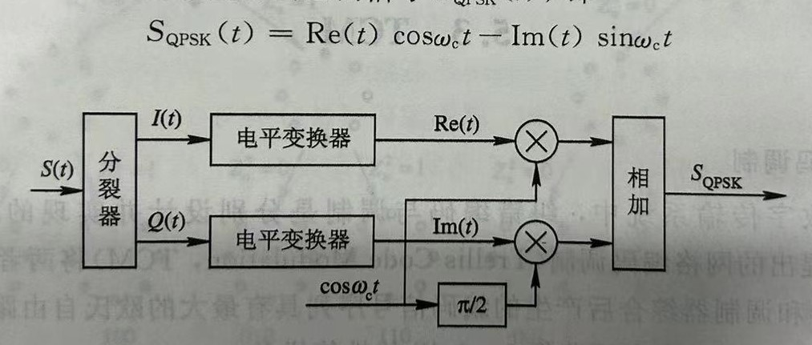

一、填空题

1. 数字电视分***标准清晰度电视***和***高清清晰度电视***。

2. 模拟视频信号通过***采样***、***量化***后转换为二进制数字信号的过程称为模拟/数字转换。

3. 多路复用分为***节目复用***和***系统复用***两种。前者是将一路数字电视节目的***音频***、***视频***和***数据***等各种媒体流按照一定的方法时分复用成一个单一的数据流。后者是各路数字电视节目的数据流进行再复用，实现节目间的***动态带宽分配***，并提供各种增值业务。

4. 数字电视广播系统由***信源编码***、***多路复用***、***信道编码***、***调制***、***信道***和***接收机***等六部分组成。

5. 常见的数字电视标准有***ATSC***、***DVB***、***ISDB***和***DTMB***。

6. 视频数据主要存在***空间冗余***、***时间冗余***、***结构冗余***、***知识冗余***和***视觉冗余***。

7. 能量扩散也称为***随机化***、***加扰***或***扰码***。

8. 多路复用是将***视频***、***音频***和***数据***等各种媒体流按照一定的方法复用成一个节目的数据流。将多个节目的数据流再复用成单一的数据流的过程。

9. 信道编码常用的差错控制方式有***前向纠错（FEC）***、***检错重发（ARQ）***、***反馈校验（TRQ）***和***混合纠错（HEC）***。

10. 在数字电视技术中，常用的调制技术有***正交振幅调制（QAM）***、***四相相移键控（QPSK）***、***网格编码调制（TCM）***、***OFDM与COFDM***和残留边带调制（VSB）等。

11. 目前数字电视广播有三个相对成熟的标准制式，***欧洲的DVB***、***美国的ATSC***和***日本的ISDB***。

二、简述题

1. 与模拟电视相比，数字电视具有许多优点，请简述什么是数字电视以及数字电视的优点。

    数字电视是一种利用数字信号传输技术来传送电视信号的电视广播系统，相比于模拟电视，数字电视具有以下优点，图像传输质量较高、具有数字环绕立体声伴音、频谱资源利用率高、多信息多功能、设备可靠维护简单、节省发送功率覆盖范围广、易于实现条件接收，是电视广播技术的重要发展方向。

2. MPEG对視领数据规定了层次结构。共分为六层，这六层分别是什么？分别简述这六层的作用。
   
    视频序列。视频序列也称图像序列，它是随机选取节目的一个基本单元。从节内容看，一个视频序列大致对应于一个镜头。切换一个镜头，即表示开始一个新的序列。

    图像组。图像组是将一个图像序列中连续的几个图像组成一个小组，简称 GOP它是对编码后的视频码流进行编辑存取的基本单元。
    
    图像。图像是一个独立的显示单元，也是图像编码的基本单元，可分为I、P和B三种编码图像

    像条。像条是发生误码且不可纠正时，数据重新获得同步，从而能正常解码的基本单元。像条由一系列连续的宏块组成。像条的第一和最后一个宏块应处在同一水平宏块排内。

    宏块。宏块是运动预测的基本单元。运动估计以宏块为单位，借此得到最佳匹配宏块的运动矢量。运动预测只对亮度阵列进行，对应的色差阵列其运动估计使用和亮度阵列相同的运动矢量。

    块又称像块，是DCT变换的基本单元。一个宏块可以划分成若干个8×8像素的阵列，简称为块，它可以是亮度块或色差信号块。像块经过 DCT 变换后得到的 64 个DCT 系数阵列可称为系数块。

3. 信道编码中常出現的两种差错的是什么？ 简述其合义。

    在信道编码中，常常会出现两种差错，分别是随机差错和突发差错。

    1随机差错：随机差错是指出现在信道中的随机噪声对信号造成的影响，通常是由于信道传输环境的不稳定性和噪声干扰引起的。随机差错的出现是随机的、不可预测的，会对信号的完整性和准确性造成影响。

    2突发差错：突发差错是指在信道中出现的连续多个比特或符号错误，通常是由于信道传输环境的不稳定性、干扰或遮挡等因素引起的。突发差错的出现是周期性的、可预测的，对信号的完整性和准确性造成的影响比随机差错更严重。

4. 什么是预测编码？

    基于图像的统计特性进行数据压缩的基本方法就是预测编码。

    预测编码一般分为帧内预测和帧间预测两种。

    1. 帧内预测：帧内预测是指在当前帧中，对每一个像素点的像素值进行预测，预测的依据通常是在当前像素点周围的邻域或者同一帧中相邻的像素点的像素值。预测误差可以通过当前像素点的像素值和预测值之差来计算，然后进行编码和传输。帧内预测一般适用于静态图像或者运动较小的图像。

    2. 帧间预测：帧间预测是指将当前帧中的像素值预测为前一帧或前几帧中相同位置的像素值，然后将预测误差进行编码和传输。帧间预测可以利用视频序列中的时间相关性，对运动区域进行预测，从而实现更高的压缩比和更高的视频质量。帧间预测一般适用于运动较大的视频图像，如运动视频、动画等。

5. 什么是多媒休信号。多媒体技术的特征是什么？

    多媒体是指两种或两种以上的媒体。媒体是指携带信息的载体，通常应该包括图像和声音，可能还有文宇、符号、图形、动面、图片等等。

    多媒体信号应具有以下三个特征：
    综合性：多媒体信号应是相互有关的多种媒体的信号的综合。

    交互性：通信双方能充分地进行信息传送或交流，能获取、处理、编辑、存储、展示这些信息媒体。

    同步性：多种媒体能同步地、协调地传送信息。

    数字化：将模拟信号转换为数字信号，实现数字化处理和传输，提高信息的质量和可靠性。

三、原图框图

1. MPEG-2原理框图以及简述编码过程。

    MPEG-2的原理框图如下所示：

    
    
    MPEG -2 编码器框图如图所示，两个双向选择开关由编码控制都CC控制，当它们同时接到上边时，编码器工作在帧内编码模式，输人信号直接进行DCT 麥换，经过量化处理后丹进行变字长编码 VLC，得到最后的编码输出。当双向开关同时接到下方时，编的希利用仔储在顺存储器FM 中的上一帧图像进行帧间预测，将输人信号与预测信号相减后，对顶测识差进行DCT 变换，经过量化处理后再进行变字长编码VLC，得到敢后的编码输出。此时，编码器工作在帧间编码模式，是一个帧问预测与 DCT 组成的混合编的器。还有还动估计和补偿处理 MEP，可改善帧间预测的效果。为丁使解码器能正确地解的，編码器的工作状态必须即时通知解码端，为此每个编码模式和控制参数等辅助信息也要进行编码传输。

2. QPSK调制过程方框图及简述其过程。
   
    下面是QPSK调制的方框图，它展示了QPSK调制的过程：
    
    

    上图是 QPSK 调制器的原理框图，码率为R的数宇序列$S(t)$经分裂器分裂为码率为R/2的I、Q信号，再由I、Q信号生成幅度为一A~A 的双极性不归零序列 $Re（t）$、$Im（t）$，$Re(t)$利$Im(t)$分别对相互正交的两个载波$cosω_ct$ 和 $cos（ω_ct+\frac π2）= -sin_ωct$进行ASK(幅度键控)调制，然后相加得到已调信号 $S_{QPSK} (t)$，即$S_{QPSK} (t) = Re(t) cosω_ct - Im(t) sinω_ct$

3. 条件系统方框图并简述DVB条件接收系统的安全性。

    下面是DVB条件系统框图

    

    CA 系统的关键是安全性。在全数字 CA 系统中，一般采用三级密钥体制。CA 系统的加扰对象是数据流，要求实时加扰，要采用能满足实时性要求的流密码 (StreamCipher)算法

4. 正交幅度调制QAM的调制过程的方框图级简述其过程。

    下面是QAM调制的方框图，它展示了QAM调制的过程：
    
    

    图5-1是MQAM正交振幅调制方框图。调制信号S由分裂器(串/并变换)分成I
    /Q两路信号，再经2-m 电平变换器以2电平信号变成m电平信号$X(t
    )$、$Y(t)$，用$X(t)$、$Y(t)$对正交的两个载波$cosω_ct$和$sinω_ct$ 进行调幅，再相加得到已调信号 MQAM。